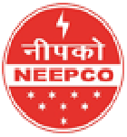
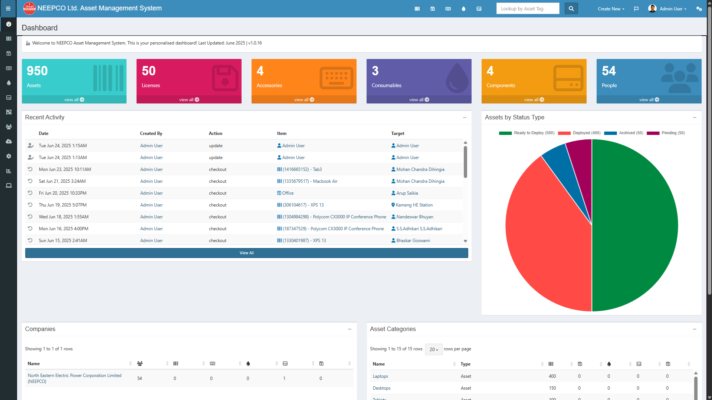
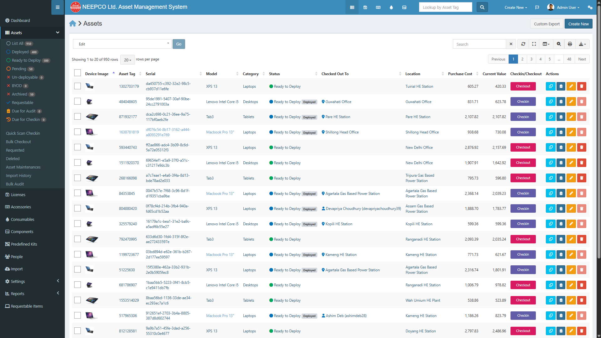
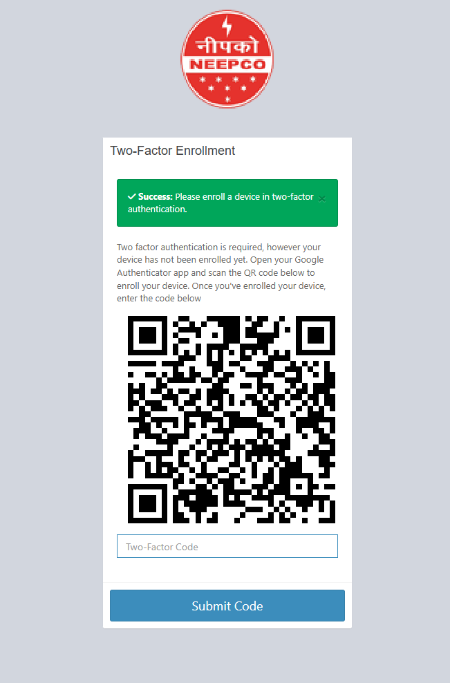
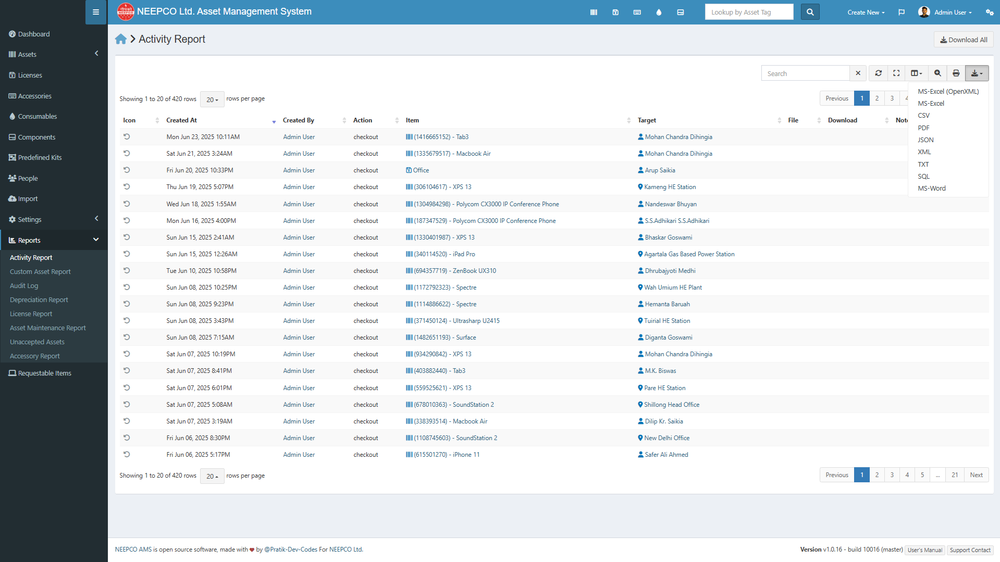

<div align="center">
  <h1>NEEPCO Asset Management System</h1>
  <a href="https://neepco.co.in/" target="_blank">
    
  </a>
  
  <p align="center">
    <a href="https://github.com/Pratik-Dev-Codes/neepco-ams/blob/master/LICENSE">
      
    </a>
    <a href="https://github.com/Pratik-Dev-Codes/neepco-ams/pulls">
      
    </a>
    <a href="https://github.com/Pratik-Dev-Codes/neepco-ams/commits/main">
      
    </a>
    <a href="https://github.com/Pratik-Dev-Codes/neepco-ams/issues">
      
    </a>
  </p>
</div>

<p align="center">
  An advanced, open-source IT asset management system developed as an internship project for <br>
  <strong>North Eastern Electric Power Corporation Limited (NEEPCO)</strong>.
</p>


## 🏢 About NEEPCO

**North Eastern Electric Power Corporation Limited (NEEPCO)** is a premier public sector enterprise under the Ministry of Power, Government of India. It is responsible for planning, designing, executing, and operating power projects in the North Eastern Region of India. This asset management system is tailored to enhance operational efficiency within NEEPCO's diverse and dynamic environment.

## ✨ Key Features

| Feature | Description |
|---------|-------------|
| 🏷️ **Asset Tracking** | Comprehensive tracking of all IT assets with QR code support |
| 🔒 **Role-Based Access** | Granular permissions for different user roles |
| 📊 **Advanced Reporting** | Custom reports with export capabilities |
| 🛠️ **Maintenance** | Schedule and track asset maintenance |
| 🔄 **Bulk Operations** | Manage multiple assets simultaneously |
| 📱 **Responsive** | Works on desktop and mobile devices |

### Core Functionality

- **Asset Lifecycle Management**: Track assets from procurement to decommissioning
- **User & Department Management**: Organize users by departments with custom permissions
- **Automated Notifications**: Get alerts for warranties, maintenance, and audits
- **Audit Trail**: Comprehensive logging of all system activities
- **API Access**: Full RESTful API for integration with other systems

### 🏷️ Asset Management
- **Centralized Asset Repository**: Single source of truth for all IT assets including hardware, software, licenses, and consumables
- **Lifecycle Tracking**: Track assets from procurement to disposal with warranty and maintenance schedules
- **QR Code Integration**: Generate and print QR code labels for quick asset identification and management
- **Check-in/Check-out System**: Seamless process for issuing and returning assets to users

### 👥 User Management
- **Role-Based Access Control**: Granular permissions with secure user roles (Admin, IT Admin, User)
- **Department Organization**: Structured user management with department-level access
- **Activity Logging**: Comprehensive audit trail of all user actions
- **User & Location Tracking**: Assign assets to specific users, departments, and physical locations

### 📊 Reporting & Analytics
- **Custom Reports**: Generate detailed asset reports with filtering options
- **Export Capabilities**: Export data in Excel, PDF, and CSV formats
- **Dashboard Analytics**: Visual representation of asset status, locations, and maintenance schedules
- **Email Notifications**: Automated alerts for expiring warranties and license renewals

### 🔧 Maintenance & Operations
- **Scheduled Maintenance**: Plan and track asset servicing with automated reminders
- **Warranty Management**: Never miss a warranty expiration with automated notifications
- **Audit Trails**: Complete history of all changes with user attribution and timestamps
- **Bulk Operations**: Perform actions on multiple assets simultaneously

## 🛠️ Tech Stack

### Backend
- **PHP 8.2+**: Server-side programming language
- **Laravel 11**: PHP web application framework
- **Laravel Horizon**: Queue monitoring and management
- **Laravel Sanctum**: API authentication
- **Laravel Excel**: Excel file import/export
- **Laravel Debugbar**: Debugging toolbar

### Frontend
- **HTML5**: Markup language
- **CSS3**: Styling
- **JavaScript**: Client-side scripting
- **Bootstrap 5**: CSS framework
- **jQuery**: JavaScript library
- **AdminLTE 3**: Admin dashboard template
- **Vue.js 3**: Progressive JavaScript framework
- **Axios**: HTTP client
- **Chart.js**: Data visualization

### Database
- **MySQL 8.0+**: Relational database
- **Redis**: Caching and queue management
- **Eloquent ORM**: Database abstraction layer

### Development Tools
- **Composer**: PHP dependency manager
- **NPM**: JavaScript package manager
- **Git**: Version control
- **Docker**: Containerization
- **PHPUnit**: Testing framework
- **Pest**: Elegant PHP testing framework
- **PHPStan**: Static analysis tool
- **PHP CS Fixer**: Coding standards fixer

## 📋 Prerequisites

Before you begin, ensure you have the following installed:

- PHP 8.2 or higher
- Composer 2.0 or higher
- Node.js 16.x or higher & npm 8.x or higher
- MySQL 8.0 or higher or MariaDB 10.4 or higher
- Web server (Apache/Nginx)
- Git

Default admin credentials:
- **Email**: admin
- **Password**: password

## 📚 Documentation

For detailed documentation, please refer to the following resources:

- [Installation Guide](./docs/INSTALL.md) - Complete setup and configuration
- [API Documentation](./docs/API.md) - API endpoints and usage
- [User Guide](./docs/USER_GUIDE.md) - User manual and features
- [Developer Guide](./docs/DEVELOPER_GUIDE.md) - Contribution guidelines and development setup

## 📊 Screenshots

<div align="center">
  <h3>Modern, Intuitive Interface</h3>
  
  | Dashboard | Asset Management |
  |-----------|------------------|
  |  |  |
  
  | QR Code Generation | Reports |
  |-------------------|----------|
  |  |  |
</div>


### Code Style

We follow PSR-12 coding standard. Please ensure your code adheres to these standards before submitting a PR.

```bash
# Fix code style issues
composer cs:fix

# Check for code style issues
composer cs:check
```

## 🛣️ Roadmap

- [ ] Mobile application for asset scanning
- [ ] Barcode support
- [ ] Advanced analytics dashboard
- [ ] Multi-language support
- [ ] API documentation with Swagger/OpenAPI

## 👨‍💻 About Me

<div align="center">
  <a href="https://github.com/Pratik-Dev-Codes">
    
  </a>
  
  ### Pratik Adhikary
  *Full Stack Developer & Open Source Enthusiast*
  
  [](https://github.com/Pratik-Dev-Codes)
  [](https://linkedin.com/in/pratik-adhikary)
  [](mailto:pratikadhikary.work@gmail.com)
</div>

I'm a passionate Full Stack Developer with expertise in building robust web applications. This project was developed as part of my internship with NEEPCO Ltd., where I had the opportunity to create a comprehensive asset management solution.

## 📞 Contact

Feel free to reach out to me for any questions, collaborations, or just to say hi! 👋

- **Email**: [pratikadhikary.work@gmail.com](mailto:pratikadhikary.work@gmail.com)
- **GitHub**: [@Pratik-Dev-Codes](https://github.com/Pratik-Dev-Codes)
- **LinkedIn**: [Pratik Adhikary](https://linkedin.com/in/pratik-adhikary)

📫 I'm always open to interesting projects and collaboration opportunities!


## 🙏 Acknowledgements

- <a target="_blank" href="https://neepco.co.in/" rel="noopener">**NEEPCO Ltd.**</a> for the internship opportunity and guidance
- <a target="_blank" href="https://www.rgu.ac/" rel="noopener">**Royal Global University**</a> faculty and staff for academic support
- <a target="_blank" href="https://laravel.com" rel="noopener">**Laravel**</a> - The PHP Framework For Web Artisans
- <a target="_blank" href="https://adminlte.io/" rel="noopener">**AdminLTE**</a> - Admin Dashboard Template

## 🌟 Show Your Support

If you find this project useful, please consider giving it a ⭐️ on GitHub!

## 🤝 Contributing

We welcome contributions from the community! Please read our [Contributing Guidelines](./docs/CONTRIBUTING.md) for details on our code of conduct and the process for submitting pull requests.

## 🤝 Contributors

<a href="https://github.com/Pratik-Dev-Codes/neepco-ams/graphs/contributors">
  
</a>

Made with [contrib.rocks](https://contrib.rocks).

## 📄 License

This project is licensed under the GNU Affero General Public License v3.0. See the [LICENSE](./LICENSE) file for details.
